  

# Hi, I'm Xuefeng Zhu

**AI & Full-Stack Engineer** building AI workflows, developer tools, and interactive products. I work across interfaces, backend services, and desktop apps, with a focus on making complex systems useful and understandable.

[Portfolio](https://xuefeng-zhu.lovable.app) · [LinkedIn](https://www.linkedin.com/in/xuefeng-zhu-a2120a58/)

---

## `~/selected-work`

01 / AGENT ORCHESTRATION

### [BAND Software Factory](https://github.com/Xuefeng-Zhu/Band-software-factory)

Preparation and runtime tooling for a seven-seat AI software factory, with bounded execution, structured handoffs, and retained run evidence.

`Python` `BAND SDK` `Codex / Claude Code / OpenCode`

02 / VOICE + AI

### [NurseBridge](https://github.com/Xuefeng-Zhu/NurseBridge)

A voice-intake demo that links extracted draft facts to caller statements and supports nurse takeover. Built to make the handoff between AI assistance and human judgment visible.

`TypeScript` `Next.js` `Cloudflare Workers`

03 / DEVELOPER TOOLS

### [PromptDock](https://github.com/Xuefeng-Zhu/PromptDock)

A local-first desktop prompt recipe manager with reusable variables, a global quick launcher, and optional workspace sync. Keeps everyday AI workflows one shortcut away.

`Tauri` `Rust` `React` `TypeScript`

04 / CREATIVE SOFTWARE

### [DoodleQuest](https://github.com/Xuefeng-Zhu/DoodleQuest)

A browser prototype that turns drawings into heroes for small, shareable 3D adventures. Combines a playful interface with a personal gift-giving experience.

`TypeScript` `Next.js` `React Three Fiber` `PostgreSQL`

---

## `~/toolbox`

| Focus | Tools & technologies |
| :--- | :--- |
| AI workflows | Agent orchestration, voice interfaces, reusable prompts |
| Frontend | TypeScript, React, Next.js |
| Backend | Python, Cloudflare Workers, PostgreSQL |
| Desktop | Tauri, Rust |

## `~/connect`

Interested in AI engineering, full-stack product development, or developer tools? Explore my [portfolio](https://xuefeng-zhu.lovable.app) or get in touch on [LinkedIn](https://www.linkedin.com/in/xuefeng-zhu-a2120a58/).
